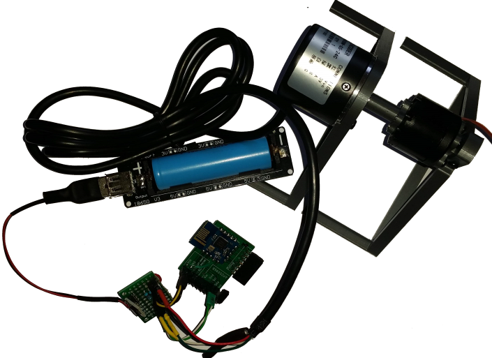
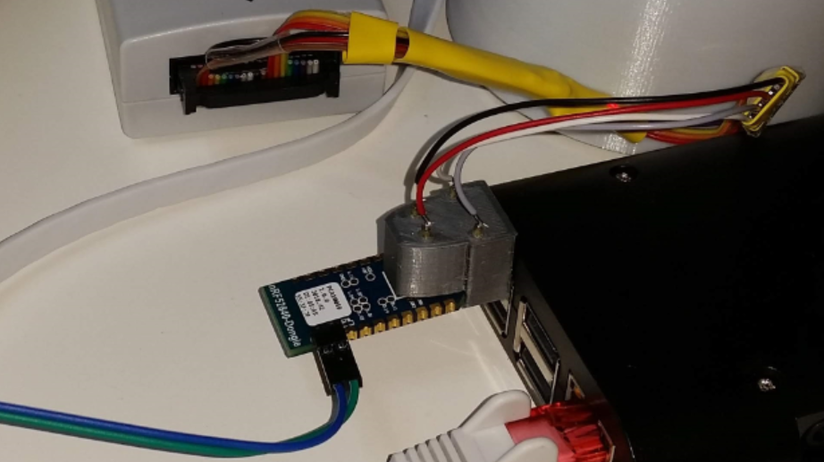
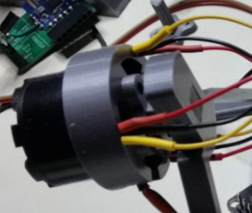
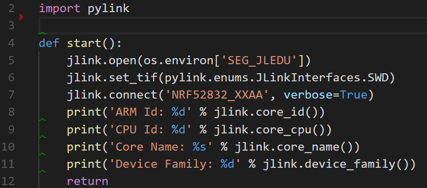
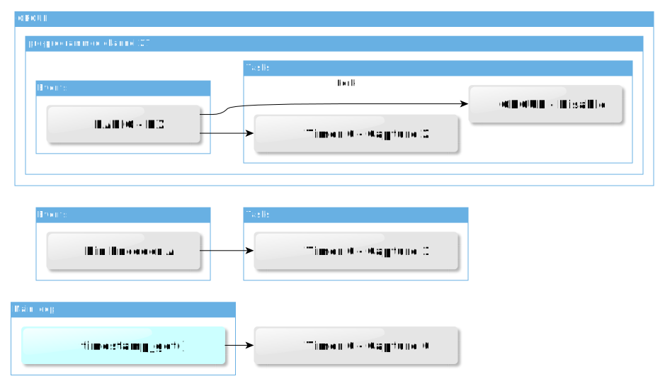
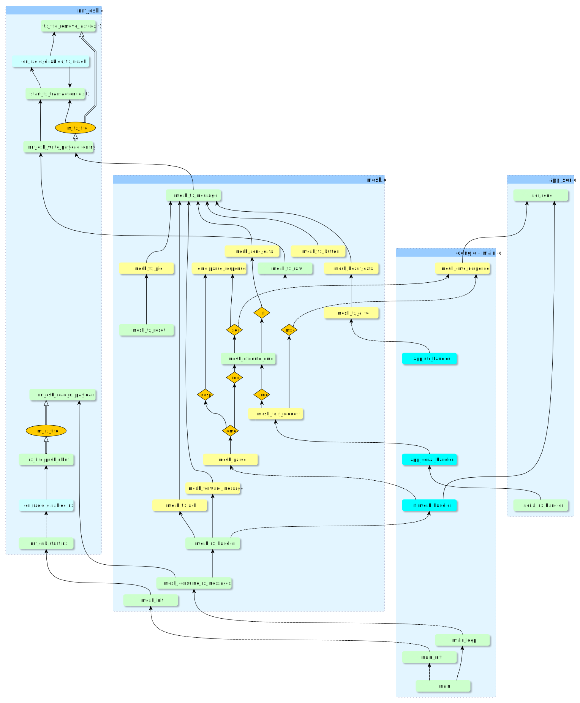

# Presentation and Documentation on [Home Smart Mesh](https://www.homesmartmesh.com/)
This readme is an extract from [Home Smart Mesh](https://www.homesmartmesh.com/) with focus on software configuration and protocol implementation details

Link to [this repository](https://github.com/nRFMesh/nRF52_Mesh)

# nRF52 Applications
    cd ./applications/

## 01 rotary decoder
    application/01_rotary_decoder> make flash

* buy : "600 pulses Optical Rotary encoder"
* custom wiring +5V, encoder pullups to +3.3 V
* rf timestamp synchronisation
* HW capture of timestamp
* RF Mesh log of modulo 600 position with timestamp
* 4 ms status on change, otherwise 4 s reminder

## 02 usb dongle (nRF52840-dongle)
    application/02_usb_dongle> make flash

* buy : "nRF52832 dongle"
* custom firmware for RF mesh
* pogo-pins jtag adapter 3dprint : [Fusion360 CAD model](https://a360.co/2CDqeTA)
* RF Mesh repeater + RF Mesh to Host interface

## 03 sensored bldc (nRF52840-dongle)
    application/03_sensored_bldc> make flash

* buy : "nRF52832 dongle"
* custom firmware for RF mesh

## ./drivers/
Contains the specific drivers for this project from which the "mesh.c" a light weight Mesh Protocol connecting all the devices using a custom RF protocol (without softdevice)
* Sleepy nodes (low power) and router nodes (always listening)
* single layer ultra simple rpotocol. App into mac with unique ids to small ids mapping
* An alternative to the Bluetooth Mesh and Zigbee Thread IPV6 world

## ./tools/
Contains the fancy Makefile extensions that allow :
* switch power on and off using a Segger jlink
* read and write parameters matching the device's unique identifier read from the HW registers

## ./nRF5_SDK_for_Thread_and_Zigbee_2.0.0_29775ac_min/
This is a submodule that minifies the nRF SDK for Thread and Zigbee which is up update over the nRF SDK 15. this minification ony has content required for this repository.

# Dependencies
* nRF52 firmare :
    * GNU Tools ARM Embedded version 6 2017-q2-update, referenced from the SDK Makefile.windows
    * Python [jlink wrapper](https://github.com/square/pylink). Used in Makefile and tools of this repo, more on [pylink.readthedocs](http://pylink.readthedocs.io/en/latest/pylink.html). Note that it has to be used with a 32 bit python version referenced in the tools scripts as **C:\Python27\python.exe**. wrapper scripts already availabe in the tools directory

## Details about the nRF52 Frimware environment

internals of the python debug utility

## Cool defines and data configuration
### Automated mesh devices configuration
 User data flashing is done with Pylink which reads in [uicr.py](tools\uicr.py) the registers of the attached device, look it up in the **NODES_CONFIG** file, retrives which parameters should be flashed, the mapping of parameters to CUSTOMER_X registers come from "uicr_map.json".

## simple board switch
The repo contais a directory for boards declaration "boards/" and a directory for applications "applications/". Although every application targets a particular board, it is possible to use any application for any other board. In the makefile a sinlge line has to be edited

    USED_BOARD := BOARD_PCA10059

## PPI automation
The programmable peripheral interconnect is used for "real" real-time operations rf time synch,...

# Home Smart Mesh - RF stack detailed design

Functions call graph. Fifos dataflow between interrupts and main loop.

